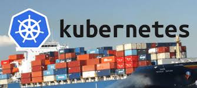

Pipelines for Containers, the workshop!
---------------------------------------

## Getting started
[Pre-work](pages/prework.md)

## Install/Configure Pipelines for Containers (PFC)
[Install/Configure](pages/install_pfc.md)

## Build and Deploy Sample App
[Sample App](pages/sample_app.md)

## Defining Delivery Pipelines
[Creating a Delivery Pipeline](pages/delivery_pipeline.md)

## Extra Projects
[Ingress](pages/ingress.md)

## Questions? Problems?
services-portfolio@puppet.com

or

john.fahl@puppet.com / @jawn

