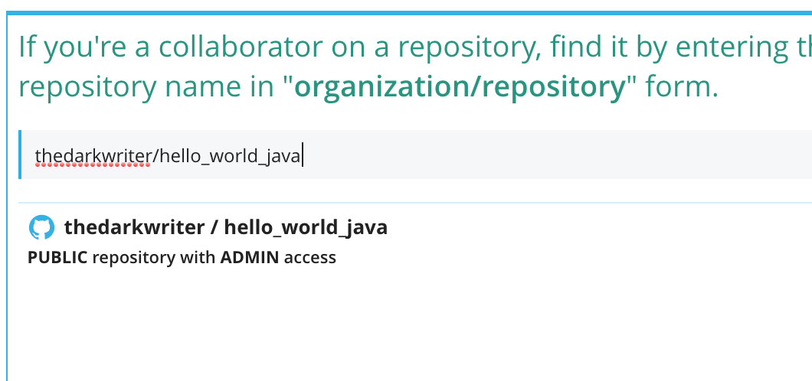
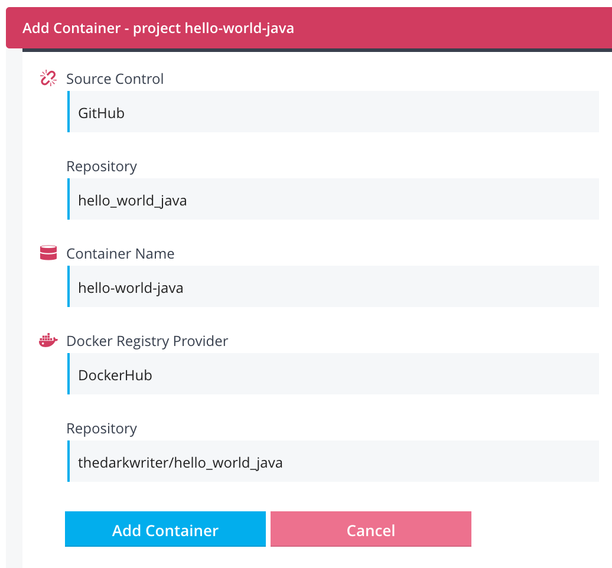
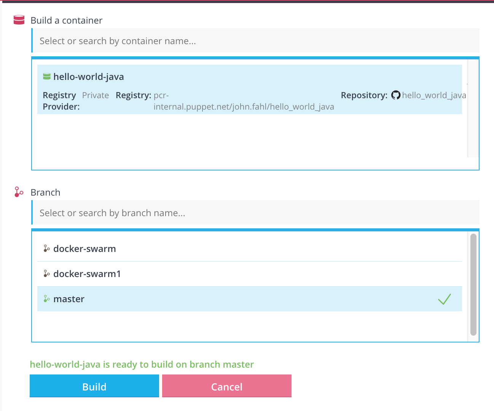
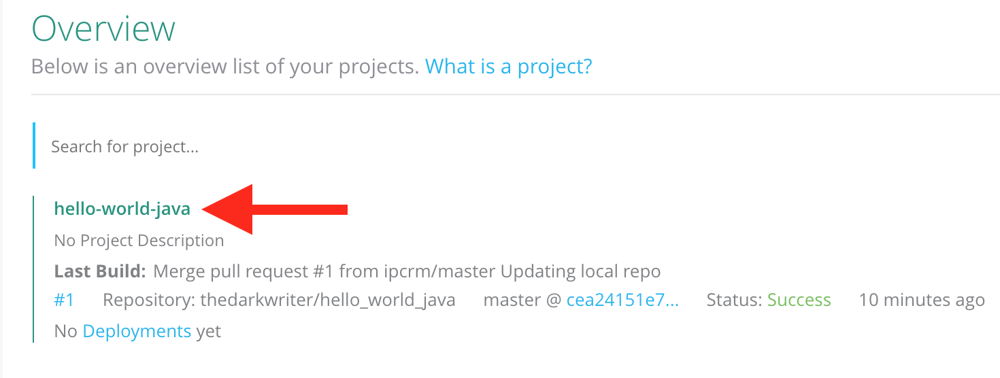
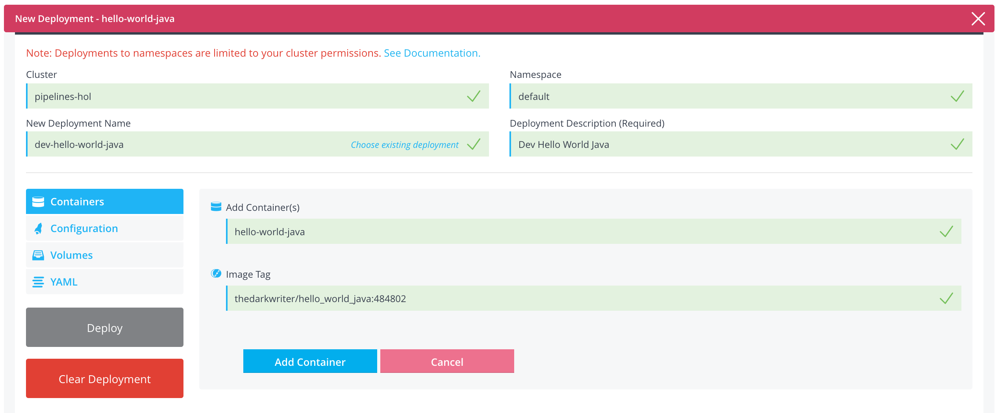
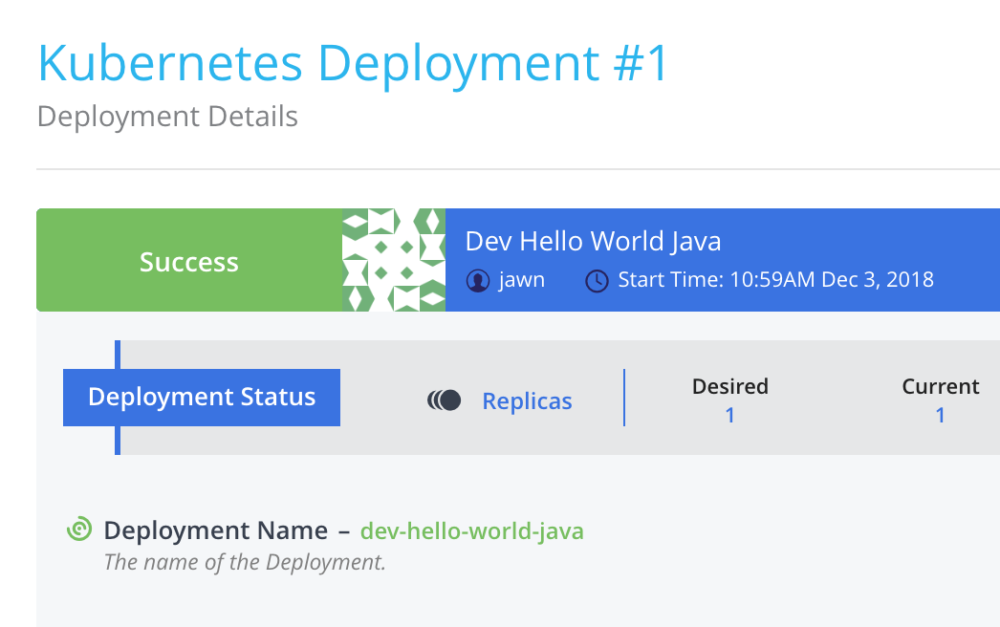
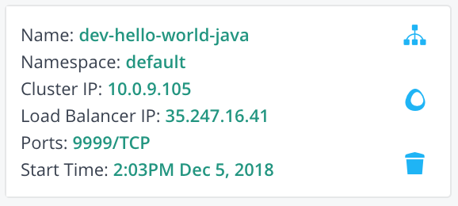
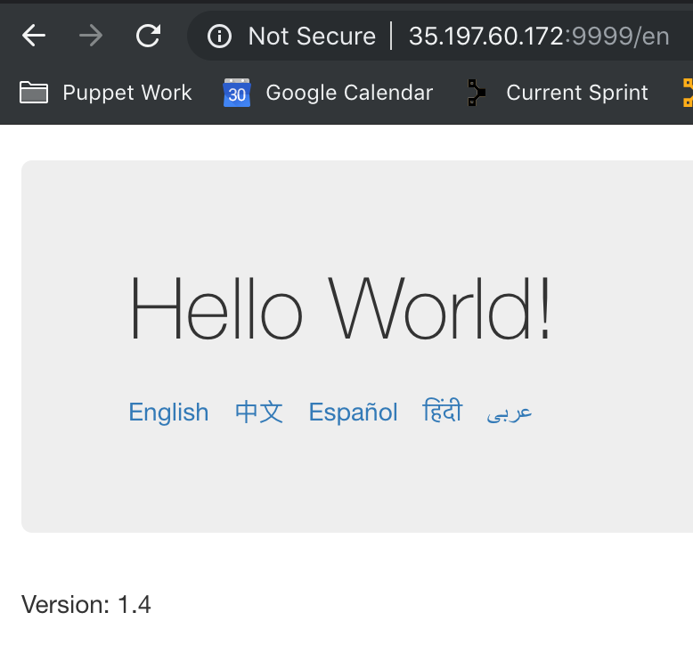

Build and Deploy through Pipelines Projects
===========================================

You should now have a GKE cluster, a buildserver, and your integrations ready. Now it is time to start building.

#### Create a Project

In PFC, it is time to create a `Project`.  A project, in PFC, is a logical grouping of container(s) that make up an application.  Typically, these containers will be deployed together but it is not required.  It is important to understand that a `Project` in PFC can include containers you are building from source as well as existing containers in an external registry.
  
  * Open your [PFC console](https://pipelines.puppet.com/).
  * Navigate to the PFC `Projects` tab
  * Click on **New Project** (top-right).
  * Enter `hello-world-java` for your project's name, and click **Create Project**.
  * In the new UI window that opens, click **Add Containers**
    * Under `Building and uploading images?`, click **Connect Source Control**
    * Click in the **Select Source Control...** box
    * In the UI that opens, click **Connect Github**
    * Click **Select Source Repository**
    * Navigate to your fork of **hello_world_java** and click it, you may have to search for it in the `Search by repository name` window. ex: \<YOURGITHUBID\>/hello-world-java
    
    

    * In the **Container Name** field, enter **hello-world-java** (NOTE: hyphens!)
    * Click in the **Docker Registry Provider** field, and select **Use Dockerhub**.
    * Click in the repository field and select the container `YOURID/hello_world_java`.
    > NOTE: You don't have to select a pre-existing repo, if you type in the name you want it will be dynamically generated during the build process

    

    * Click **Add Container** and then click **Close**.

#### Configure Build Steps

Your first container is added, let's customize several build options.
  
  * On the right side, in your `hello-world-java` project, under containers, click the **Build Instructions** icon 
  * You'll notice some details are already populated, specifically around docker building. This is just template info, let's replace it.
  * Delete everything in the `build` section of the configuration options.
  * Copy and paste in the following code:
    ```
    mvn clean test
    mvn clean package
    docker login -u "$DISTELLI_DOCKER_USERNAME" -p "$DISTELLI_DOCKER_PW" "$DISTELLI_DOCKER_ENDPOINT"
    docker build --quiet=false -t "$DISTELLI_DOCKER_REPO" "$DISTELLI_DOCKER_PATH"
    docker tag "$DISTELLI_DOCKER_REPO" "$DISTELLI_DOCKER_REPO:$DISTELLI_BUILDNUM"
    docker push "$DISTELLI_DOCKER_REPO:$DISTELLI_BUILDNUM"
    ```
    > NOTE: There are duplicated Maven steps here because `package` will run the tests - however for consistency and clarity both steps are included here.
  * Further down in the window, you'll see `Build Hardware` and a couple of radio buttons.  Click the **Build on my own hardware** Radio button.
    > Wait a sec; why not shared hardware?  You won't be setting that up for this tutorial, but you can learn more [here](https://puppet.com/docs/pipelines-for-containers/enterrise/index.html). 
  * In `Build Capabilities` enter **Java**, press Enter.
  * Click **Save**, and after the green pop-over fades away, scroll up and click the **X** on the top red bar

### Add Notification on Builds and Deployments

* In your `hello-world-java` project, click the **Notifications** tab. 
* On the right, in `Build Notifications`, click **hello-world-java**.
* This will open options to enter on the left. Notification and Medium options are drop down windows:
  * Notification Type: **Build Completed**
  * Medium: **Email**
  * Email: *youremail@company.com*
  * Click **Add Notification**
* On the right, under `Deploy Notifications`, click **pipelines-hol**.
* Click the **Notifications** tab.
* Below, click the **default** namespace.
* This will open options to enter below. Notification Type and Medium options are drop down windows:
  * Notification Type: **Deployment End**
  * Medium: **Email**
  * Email: *youremail@company.com*
  * Click **Add Notification**

#### Time to Build

* In the PFC top menu, click **Projects**.
* Click your **hello-world-java** project.
* In the upper right hand of the UI, click the **Build** hammer icon. 
* A new window will open. In the `Build a container` section, click the **hello-world-java** container.
* Select the **master** branch



* Click **build** and then click **View build**
> This process will take approximately 3 minutes.
* You will now see a screen where you can watch the build happen.  The first process you see will have a lot of Maven noise but the second operation (`package`) that executes will be a lot quieter so you can see exactly what's going on.
* Once the build completes, PFC will push the built image to dockerhub (because you entered the information in the build configuration options).
* Click the **Projects** button in the very top menu.
* You will see your `hello-world-java` project. Click the green **hello-world-java** name, which will take you into that project.



* You are in the `containers` information tab of `hello-world-java` project.  You'll now see that a successful `Build` occurred and a new `Image` successfully built. If you click the `Image` you'll get details of this image including the image layers.

> NOTE: You can also browse to Dockerhub to verify a new image upload.

> NOTE: You should also receive an email notification.

#### <a src='timetodeploy'>Time to Deploy</a>

The container is built, the cluster is also added to PFC. You are ready to deploy the container to kubernetes.
  
* In the top menu, click **Projects**.
* Click your project **hello-world-java**.
* In the right menu, click the **Deploy** rocket button 
  * Click in the **cluster** field then select the `pipelines-hol` cluster.
  * Click in the **namespace** field then select `default`.
    
  > If you want to understand namespaces better, here is further [reading](https://kubernetes.io/docs/concepts/overview/working-with-objects/namespaces/).
    
  * Click in the **Deployment Name** field then select `CREATE NEW DEPLOYMENT`
    * Enter the name: `dev-hello-world-java`
  * Click in the **Deployment Description** field then enter: `Dev Hello World Java`
  
  Further down the the screen, you will see that `Containers` is already selected. Now you will add the container to the deployment.
    * Click in the **Select Container** field, and then select `hello-world-java`.
    * Click in the **Select Image Tag** field, choose the container you've built. There should be only one unless you've built multiple. It will also be tagged with the Pipelines build number, if so, picked the highest number. It will likely be in the format of:`<YOURID>/hello_world_java:456454`.
    
    * Click **Add Container**.
    
    > There is a lot you can configure about a deployment.  For this deployment we don't actually need to adjust anything, but take the opportunity to click around in this interface.  You can adjust per container properties (port mappings, volumes, env vars), or deployment wide settings like deployment strategies revision history or volumes.
  
  * Click **Deploy** and it will launch your new deployment and supporting pod(s).
  * Now that `Deployment has initiated`, click **Click here**.  
  * In this window you will get an overview of the deployment status. This window is not like the build window where you get a stream of the running process. If the deployment is a success or failure, it will update the message block. You should see `Success` in the upper left hand side.
  
  
  
  * Once completed, in the very top menu, click  **Clusters**.
  * Click **pipelines-hol**.
  * From the cluster overview page, you'll see `Pod Sets` section.  Look for `Pod Name: dev-hello-world-java...` in the list.
  
    > NOTE: Depending on how long the download of the image takes you might see a loading spinner next to your pod.  This is because it is still initializing (in this case waiting to finish downloading the image from Dockerhub). You'll need to wait for that to finish before you move on.  If you want more detail you can go your `Cloud Shell` and use `kubectl describe pod <pod>` to view the events.
  
  * On the right hand side, click on the `View Pod Logs` icon .
  * In the new screen, click the **Log** slider
    * Just like when we ran this app locally on our laptop, we can now see the STDOUT from this container and validate its up/running.
      
  > You should have received an email deployment notification.
  
  #### <a src='createservice'>Creating a Service</a>

  To access your dev deployment, you must create a `service` in k8s.  There's a few different types of services; you can read about them [here](https://kubernetes.io/docs/concepts/services-networking/service/).  You want to access this service extenerally sou you will be setting up a `LoadBalancer` service.  You will now create a `LoadBalancer` service for `hello-world-java`.
    
  * In the very top menu, click **Projects**.
  * Click **hello-world-java**.
  * Click the **Services** tab.
  * Select your cluster - `pipelines-hol` - from the list and click **Create a new service**.
  * Unlike the Deployment workflow that is 100% GUI driven, here you define a service in its native YAML format.  There's an option to `Load default service spec` (don't click it right now) that will give you 99% of what you need and you just update the ports.
  * However, for today, copy/paste this into the window:
    ```
    apiVersion: v1
    kind: Service
    metadata:
      name: dev-hello-world-java
      labels:
        app: hello-world-java
        stage: dev
    spec:
      ports:
        - port: 9999
          nodePort: 32100
          name: nodeport
      selector:
        deployment: dev-hello-world-java
      type: LoadBalancer
    ```
    * Here is what this YAML config is doing:
      * The first two lines are defining the version of the api this definition uses and the type of definition it is
      * Lines 3-7 are defining what the service should be called, and the labels associated with it so this can be found more easily via selectors
      * Lines 9-12 are the primary config.  
        * Line 10 defines the container port (`9999`).
        * Line 11 defines the `nodePort`, that is the port on the actually k8s node(s) that should be exposed for this service (`32100`).
        * Line 12 defines a friendly name to the port; again this is to make it easier to find/use in other definitions ... such as [Ingress](https://kubernetes.io/docs/concepts/services-networking/ingress/).
      * Lines 13-14 defines which deployment this service exposes.  Using the selector, you are telling your service to expose a deployment named `dev-hello-world-java`.
      * Line 15 defines the type of service we are creating.
  * Once pasted into the box; click **Create Service**.  You should see a `Successfully created...` pop-over.
  * Click **Go to Cluster Details**.
    * On the right side you'll see 3 tabs: `Deployments, Services, and Jobs`.  Click **Services**.  From the list you can now see your new service and are able to inspect it.
  * In the `dev-hello-world-java` You will see the `Load Balancer IP:` which is the external IP. 
  
    
  
  * You can access your dev app in your browser, go to *\<ExternalIP\>:9999*
    
    

In the next section you will be defining a [delivery pipline](delivery_pipeline_gke.md).