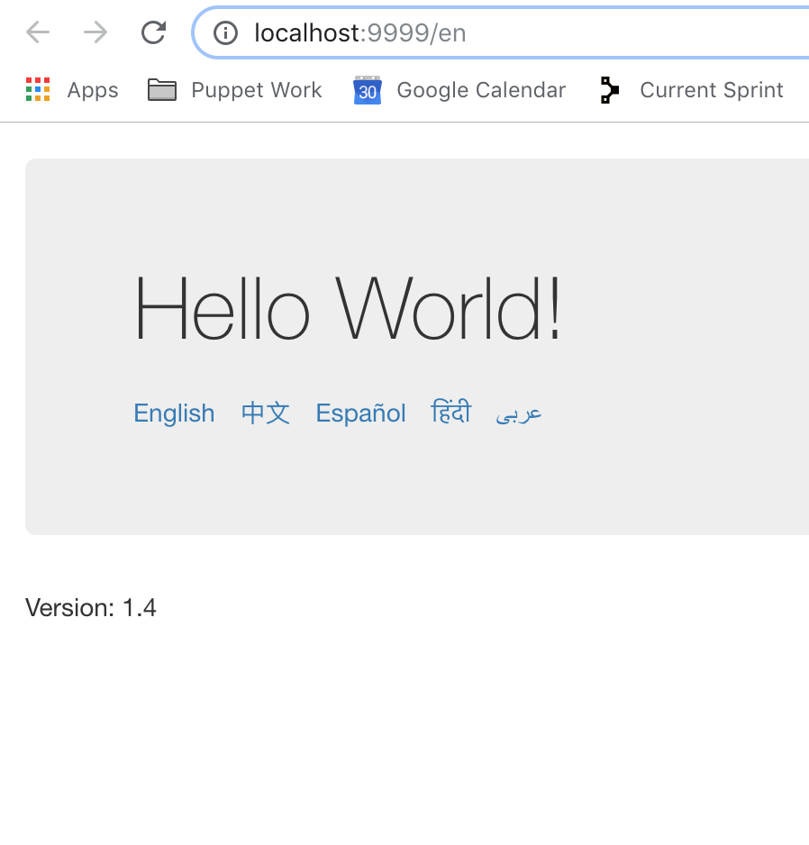
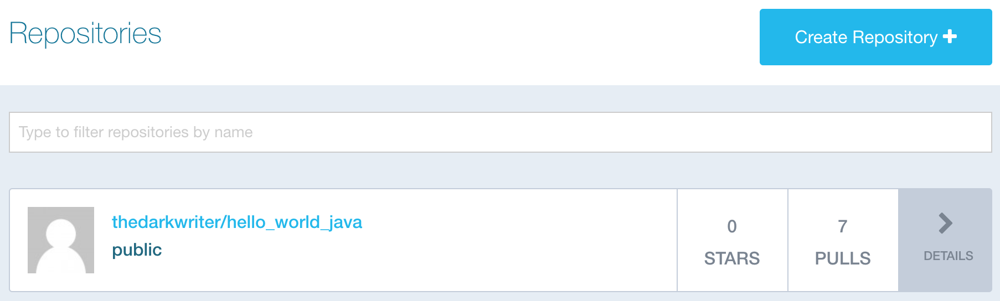
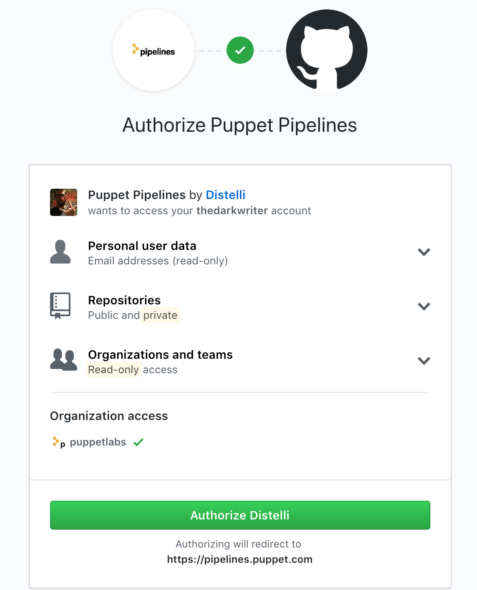
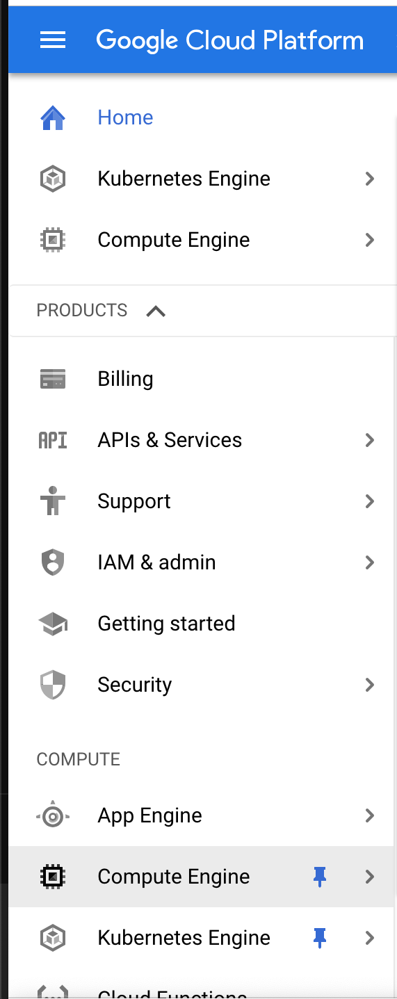
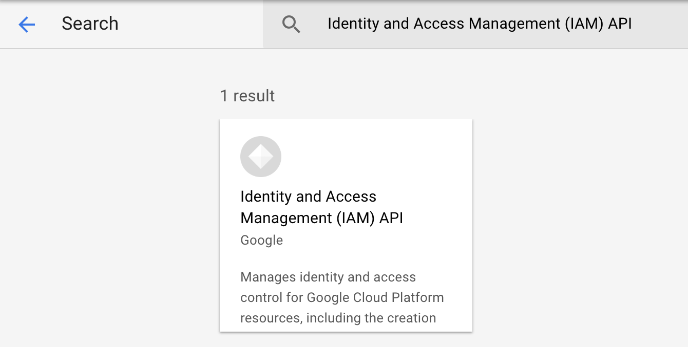
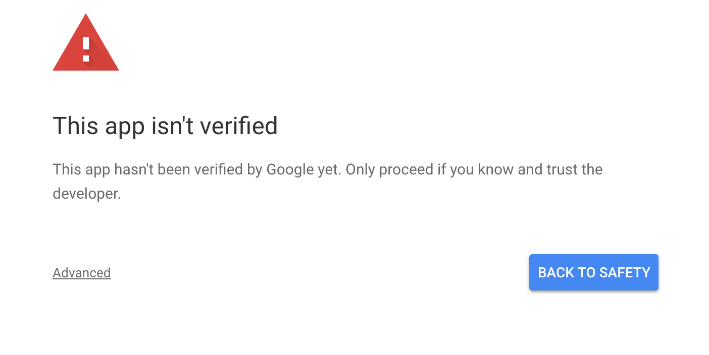
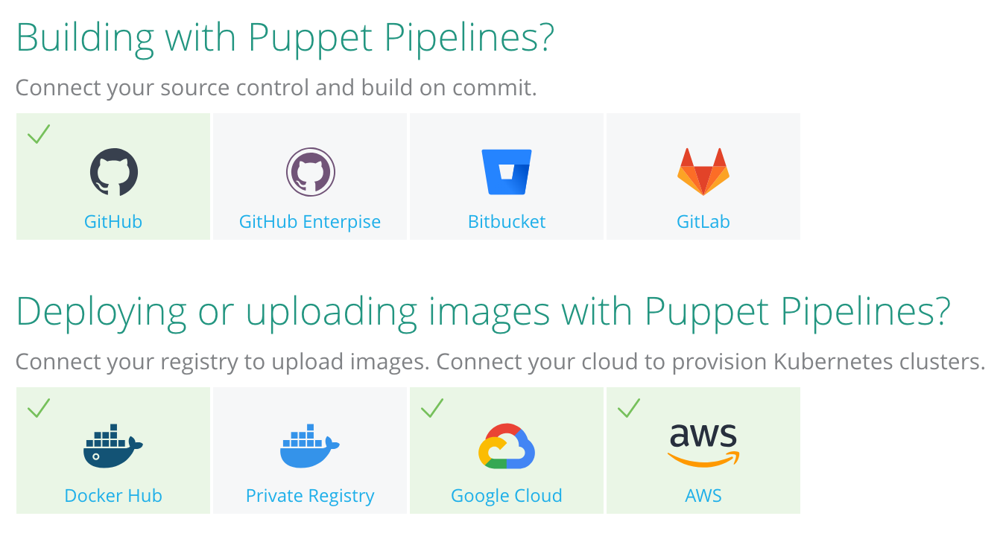

Configure Integrations
======================

You will now be priming your environment and connecting to the various resources needed to perform this lab, such as Google Cloud Platform (GCP), Dockerhub, and Github.

# Get the code; build it locally

* The application will be, you guessed it, a `hello_world_java` application; found [here](https://github.com/puppetlabs/hello_world_java)
  * Make a fork of this code on Github.
  > IMPORTANT: For this lab to work correctly, you must be working from your fork.
  * Create a local git clone on your laptop and `cd` into that directory
* Once you clone the git repo, you will have a java application in your current working dir.  Its a really basic `hello world` application. The source code is instrumented with a very lightweight testing suite.  When you 'build' the application - these tests will be run first.
  * To build/test this app, you'll use `maven`. Open a shell on your laptop and type:
    ```
    mvn clean test
    ```
    > Note: If you've never used mvn before; you'll likely see a ton of downloading going on - totally normal
    * You should now be looking at some results like this
    ```
    [INFO] ------------------------------------------------------------------------
    [INFO] Reactor Summary:
    [INFO]
    [INFO] hello-world ........................................ SUCCESS [  0.262 s]
    [INFO] polyglot ........................................... SUCCESS [  3.416 s]
    [INFO] java-webapp ........................................ SUCCESS [ 14.789 s]
    ```
    * Now, package up this app so you can start a local copy
    ```
    mvn clean package
    ```
    * You should see the same successful results from `Reactor`, but you'll also notice lines like this in your output:
    ```
    [INFO] --- maven-jar-plugin:3.0.2:jar (default-jar) @ java-webapp ---
    [INFO] Building jar: /Users/<userid>/git/hello_world_java/java_webapp/target/java-webapp-1.4.jar
    ```
    *  Launch the Jar file from your terminal. If you are in the base of the hello_world_java directory, start the jar by executing:
    ```
    java -jar ./java_webapp/target/java-webapp-1.4.jar
    ```
      * You can now connect to `http://localhost:9999` or click [here](http://localhost:9999) to see the running application.
      > In your terminal, Control+C to kill the app after you've verified you can reach the page. It should look like this:


      

    * Now that you have a basic application, let's turn the application into a docker container.
  
### Time for Docker

In the following sections you will see \<YOURID\>, this is your dockerhub ID, such as `foomaster`.

* First, let's build the container. In your terminal, execute:
  ```
  docker build -t <YOURID>/hello_world_java:1 .
  ```
* Are you wondering what just happened? Let's examine the Dockerfile in the root of the hello_world_java directory.
  * `FROM openjdk:9`: This is the base image to pull and prime with configuration.  By using this image as your 'base' you automatically get Java 9 installed so we don't have to deal with it. (This is a public image located [here](https://hub.docker.com/_/openjdk/))
  * `MAINTAINER puppetlabs`: Who maintains this file.
  * `COPY ...`: Copying the jar file from our working directory into the docker image being build (so we can run it!)
  * `WORKDIR /usr/src`: This tells Docker where the working directory should be for RUN, CMD, or ENTRYPOINT blocks
  * `CMD ...`: This the command that we want to run when the container starts; in our case firing up the `hello world` app
  * `EXPOSE 9999`: Serves as documentation of which ports this container listens on; or in the case of using the `-P` option when running the container docker will automatically map this port to a dynamic port on the host running the container
  * You can read more about available options for Dockerfiles [here](https://docs.docker.com/engine/reference/builder)
* Provided your build succeeded, you can now list your newly created image:
  ```
  $ docker images | grep hello_world_java

  #output
  ...
  thedarkwriter/hello_world_java                                                 1                   83fc195ee226        2 hours ago         870MB
  ```

* Let's start the application, but as a container
  ```
  docker run --rm -it -p 9999:9999 thedarkwriter/<YOURID>/hello_world_java:1
  ```
  * And navigate to `http://localhost:9999`
    * Congratulations!  You've just `dockerized` your application.  Not so mystical, is it?
    * Ctrl-C to kill your running container (since it's in the foreground)

* Time to push this container to Dockerhub.
```
# The prompt will ask you for your password to login
docker login -u <YOURID>

# Push the container
docker push <YOURID>/hello_world_java:1
```
* After >30 seconds, your container will be pushed. 
* Login at [Dockerhub](https://hub.docker.com) to verify you see the container now available.



### Conntecting Github, Dockerhub, Google to PFC

Now that you have a container and it is published in Dockerhub, it is time to integrate services into PFC.

Login to [Puppet Pipelines](https://pipelines.puppet.com).
> Important: In the upper-left you will see the Puppet logo with a down-arrow that is either green or red. For this entire lab, you will be using `Pipelines for Containers` which is the **Green** arrow. If and when following any instructions, menus don't look correct or aren't what you expect, you are probably in `Pipelines for Applications` and need to click the down arrow and select `Pipelines for Containers.`

 

#### Github

* In the top menu of Puppet Pipelines, click **Integrations**.
* In the top row, click **Github**.
* Click **Connect Github Account**.
* You will be asked to authorize pfc into your github account. Click **Authorize Distelli**. 
>You will notice it is authorization access to `https://pipelines.puppet.com`.



* If prompted, enter your password and/or pin.

* Beware, this action may have switched you back to default `Pipelines for Applications`. Verify and change back to `Pipelines for Containers`.

 

#### Dockerhub

* In the top menu of Puppet Pipelines, click **Integrations**.
* In the second row, click **Docker Hub**.
* In the next window, enter your Dockerhub credentials.
* Click **Connect Docker Hub**.

#### Google Cloud Platform

* Login to your [GCP account](https://console.cloud.google.com). If this is a new account, you will want to pin two services to make navigation easier:
  
  * Kubernetes Engine
  * Compute Engine

* In the left column, scroll down until you find the `Compute` section. You will find `Compute Engine` and `Kubernetes Engine`. When you mouse over each, you will see a thumbtack illuminate that you can click and pin the service to the top of the menu. Do this for each service.



Next, you will enable several API endpoints in GCP otherwise the integration with Puppet Pipelines will be unsuccessful.

* In the GCP left menu, scroll down under `Products` and click on **APIs & Services**. *Optionally, you can pin this item, but you won't need it again in this lab.*
* In the left menu, click **Library**.
* In the search bar, enter:
  * Identity and Access Management (IAM) API
  * Click on the **Identity and Access Management (IAM) API** resource that is returned from the search.

  

  * Click the blue **ENABLE** button.
  * Follow the same process to enable the next three APIs:
    * Cloud Resource Manager API
    * Compute Engine API    # Should be already enabled
    * Kubernetes Engine API # May be already enabled
  
You will now connect to GCP through Puppet Pipelines.

* In the top menu, click **Integrations**.
* In the second row, Click **Google Cloud**.
* Click **Google Cloud Platform**.
  * Enter your GCP redentials
  > If you get any warnings, such as "This App isn't verified", click **Advanced** and click **Go to Puppet Pipelines(unsafe)**.
  
  

  * If it asks "Puppet Pipelines wants to access your Google Account", click **Allow**.

#### Verify your integrations

* In the top menu, click **Integrations**.
* You should see Github, Docker Hub, and Google Cloud with green checks.



Excellent. Now you can move onto creating a [GKE cluster](setup_gke.md).