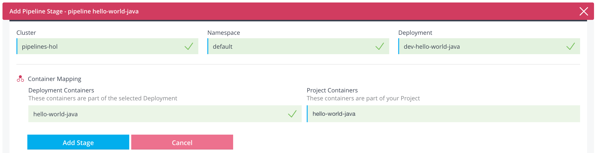
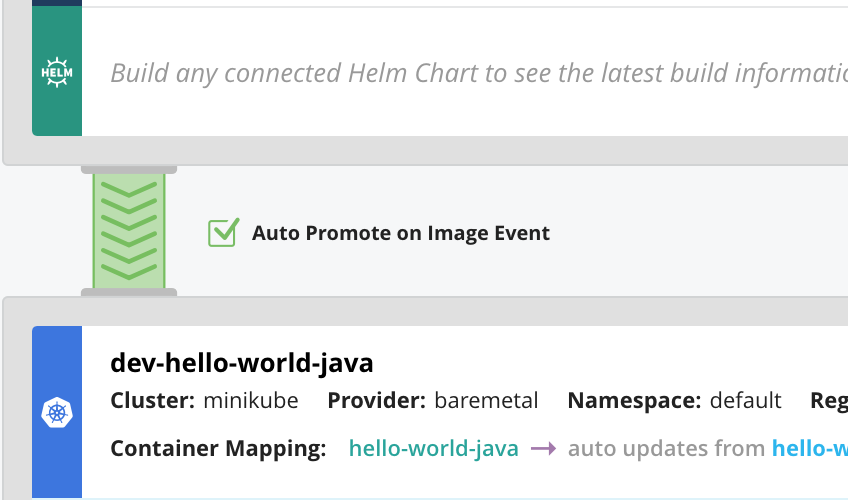
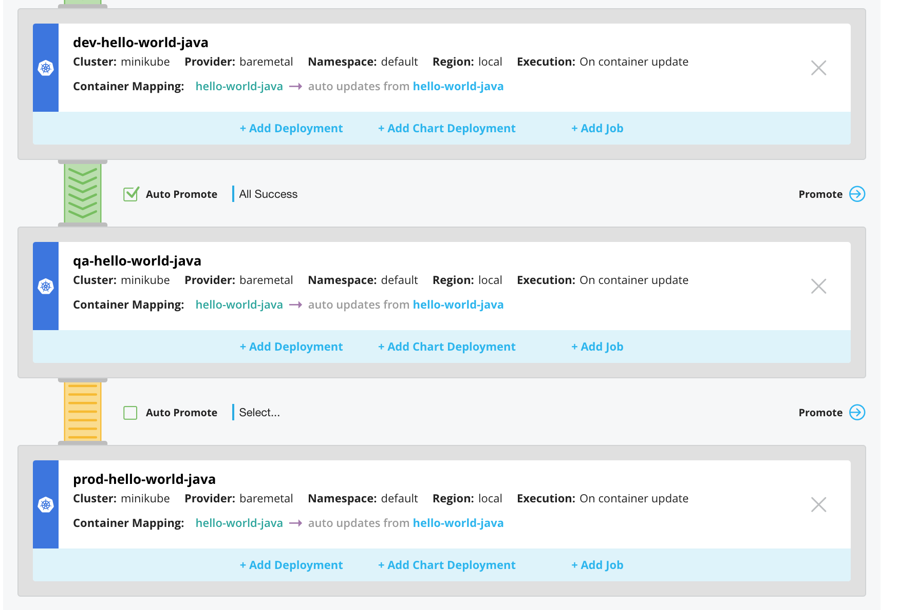
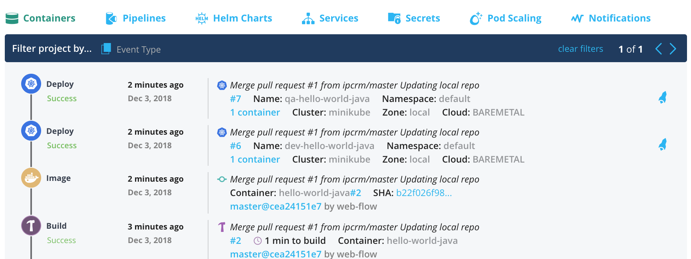
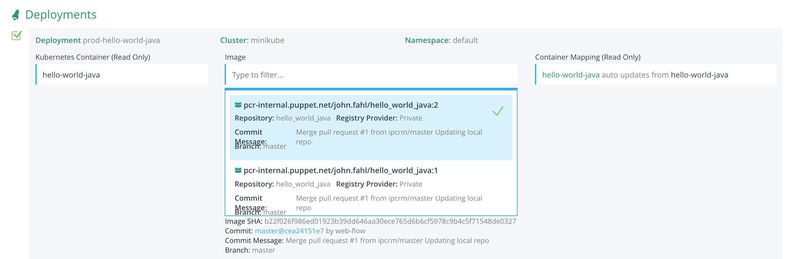
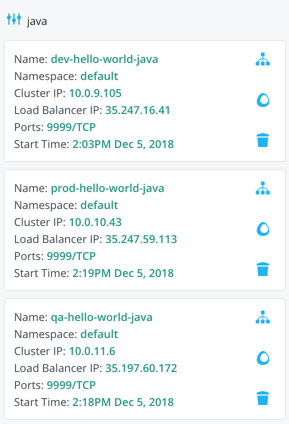
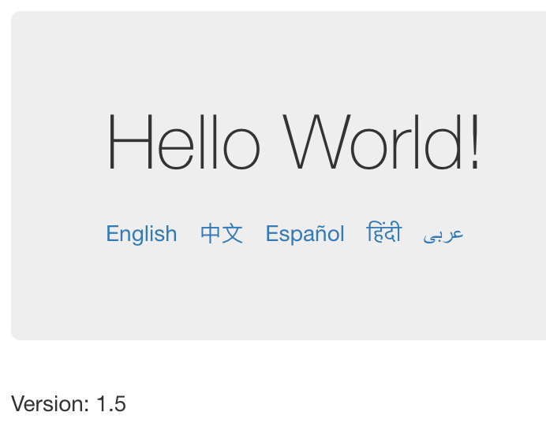

Creating a Delivery Pipeline
============================
Up to this point, you have manually launched builds and deployments. It's time to set PFC to trigger deployments into a pipeline any time there are source code changes.
  
  * In the very top menu, click **Projects**.
  * Click the **hello-world-java** project.
  * Select the **Pipelines** tab.
  * On the right hand side, click **+ Create Pipeline**.
  * Click the `Enter Pipelines Name` field and enter `hello-world-java`.
  * Click **Create Pipeline**.
  * In the next UI, click **Add Containers**.
  * Click the **Select Container** field, then select **hello-world-java**.
  * In the **Select Branch** field, click on **master**
  * In the **Branches that match the following regex (overrides selected branch)**, enter: **.***
  * Click **Save Source** and then **Close**
  * You've now `registered` the master branch for auto-build. Any time new code is pushed to `master` or other branches, you'll build a new container.
  * Next, you will be adding deployment stages to your pipeline.
    * At the bottom of the UI, click **Add Deployment Stage**.
      * Click on **Select Cluster** and select **pipelines-hol**.
      * Click on **Select Namespace** and select **default**.
      * Click on **Deployment** and select **dev-hello-world-java**.

      

      * Click **Add Stage** and **Close**.
      * Next, you will see a yellow "pipe" connecting the build stage window to your dev deployment. Check the **Auto promote on Image Event**... checkbox

      

      * Now anytime the source for **master** is built, it will create a new image and auto-deploy to **dev-hello-world-java**.
  * To set the pipeline to automatically build and deploy on PR and/or a commit, click the **Auto Build** link under source.
  * Ensure `Commit` is checked. Optionally, you can check `Pullrequest`.
  * Click the red **X**.

#### Adding QA and production environments  

Before you can add these deployments, you must first create them.
  
* Follow the [Time to Deploy](sample_app.md#timetodeploy) section and repeat all steps from above, but use  **qa-hello-world-java** and **prod-hello-world-java** for the deployment names.  

After successfully deploying the two new environments, you should see them in the `Clusters` menu.

Or, you can query the deployments and pods on the `Cloud Shell` command line:
```
# Get deployments
kubectl get deploy | grep java

dev-hello-world-java    1         1         1            1           48m
prod-hello-world-java   1         1         1            1           48s
qa-hello-world-java     1         1         1            1           1m

# Get Pods
kubectl get pod -o wide | grep java 

dev-hello-world-java-dd5949f87-zszjj     1/1       Running   0          49m       10.0.2.5   gke-pipelines-hol-default-pool-16e2cae2-x0pm
prod-hello-world-java-6d6bccfddf-hwpqs   1/1       Running   0          1m        10.0.1.7   gke-pipelines-hol-default-pool-16e2cae2-3rf6
qa-hello-world-java-7857fccc86-rdqd2     1/1       Running   0          2m        10.0.1.6   gke-pipelines-hol-default-pool-16e2cae2-3rf6

# Get Services
kubectl get services | grep java

dev-hello-world-java   LoadBalancer   10.3.254.185   35.197.60.172   9999:32100/TCP   32m

# OH NO, the services are missing for QA and PROD
 ```
 > IMPORTANT, ensure you do not use port 32100 in the next step when you create the service, as this port is already in use. Pick 32200 and 32300 for QA and PROD respectively. Update the selector and metadata in the copy/paste YAML config.

 ex:
 ```YAML
 apiVersion: v1
 kind: Service
 metadata:
   name: dev-hello-world-java  # Replace dev with qa or prod
   labels:
     app: hello-world-java
     stage: dev  # Replace dev with qa or prod
 spec:
   ports:
     - port: 9999
       nodePort: 32300 # Replace 32100 with 32200 or 32300
       name: nodeport
   selector:
     deployment: dev-hello-world-java # Replace dev with qa or prod
   type: LoadBalancer
 ```
* Follow the [Creating a Service](sample_app.md#createservice) steps to create service definitions for each new deployment.
  
In the command line, you should now see all three services:
```
kubectl get services | grep java

dev-hello-world-java    LoadBalancer   10.3.254.185   35.197.60.172   9999:32100/TCP   43m
prod-hello-world-java   LoadBalancer   10.3.248.98    35.247.28.179   9999:32300/TCP   5m
qa-hello-world-java     LoadBalancer   10.3.244.142   35.247.8.114    9999:32200/TCP   6m
```

#### Final deployments

It's time to add those additional deployments into your pipeline. 

  * In the very top menu, click **Projects**.
  * Click your **hello-world-java** project.
  * Click the **Pipelines** tab.
  * Scroll down and click **Add Deployment Stage**.
    * Click on **Select Cluster** and select **pipelines-hol**.
    * Click on **Select Namespace** and select **default**.
    * Click on **Deployment** and select **qa-hello-world-java**.
    * Click **Add Stage**.
    * Click **Close**.
  * Repeat the last steps except select **prod-hello-world-java**.
  * Check the checkbox for `Auto Promote` for the qa-hello-world-java deployment but leave `Auto Promote` unchecked for prod-hello-world-java.

  

* In the top-right corner of the UI; start a build by clicking on the `Build` hammer 
  * Select **hello-world-java**.
  * Select **master**.
  * Click **Build**.
  * Click **View Build**.
  * Wait for the build to complete.
* Once the build has finished you will see `dev` and `qa` were automatically deployed. The **status** will change to **running** and then **success**.
* On the very top menu, click **Projects**.
* In the log window, you should see that the dev and qa deployments were successful.

> Note, you should have received two deployment emails.



Now push to Prod.

  * Click the **Pipelines** tab.
  * Scroll down to the `prod-hello-world-java` section.
  * On the right, click the **Promote** button 
  * In the middle of the page, check the checkbox next to the `Deployment: prod-hello-world-java` section.
  * Click in **Image** field and ensure the most recent image is picked. *There should be two images if you've followed the guide*

  

  * Click **Promote**.

* In the very top menu, click **Projects**.
* Click your **hello-world-java** project.

You should now see the deployment success for prod.

In the command line, you can verify all three environments are running the version of your build.
```
kubectl get deploy -o json | jq '.items[]| .metadata.labels.deployment + "  =   " + .spec.template.spec.containers[].image'  | grep java

"dev-hello-world-java  =   pcr-internal.puppet.net/john.fahl/hello_world_java:2"
"prod-hello-world-java  =   pcr-internal.puppet.net/john.fahl/hello_world_java:2"
"qa-hello-world-java  =   pcr-internal.puppet.net/john.fahl/hello_world_java:2"
```
* Get your three services, in the top menu click **Clusters**.
* Click the **pipelines-hol** cluster.
* On the left, click the **Services** tab.
* In the filter window, enter **java**. You should see three services appear:



Verify your applications are online by browsing to their respective *\<Load Balancer IP\>:9999*.

Nice job completing this section of the lab.

One more change?

#### Push an update

You can make a change to the hello-world-java application and push to Github so we can see Pipelines work its magic. For the demo, let's make the change on master.

* Either from Github (performing a direct commit) or through your terminal shell, make changes to the following files in the `hello-world-java` repo.

Edit:
./Dockerfile
  ```
  # Current
  COPY java_webapp/target/java-webapp-1.4.jar /usr/src/java-webapp-1.4.jar
  # Update
  COPY java_webapp/target/java-webapp-1.5.jar /usr/src/java-webapp-1.5.jar 
  
  # Current
  CMD java -jar java-webapp-1.4.jar
  # Update
  CMD java -jar java-webapp-1.5.jar
  ```
If you prefer `sed` you can execute from your shell: `sed -i '' s/1.4/1.5/g Dockerfile` 

/java_webapp/pom.xml
  ```
  # Current
  <version>1.4</version>
  # Update
  <version>1.5</version>
  ```
If you prefer `sed` you can execute from your shell: `sed -i '' s/1.4/1.5/g java_webapp/pom.xml`

* Add those two files to a commit and push it to your fork.
* In the PFC top menu, click **Projects**.
* Click **hello-world-java**.
* You should now see the build and deployments automatically happen.
> Note: You should also receive emails.
* Once the deployments finish, navigate to your dev and qa applications in your browser. You should see them with the updated `1.5` version. If you browse to your production service, it should still be at `1.4` because there is a manual promotion required.
* Back in PFC, you can promote your production push!



Congratulations! We hope you have enjoyed this intro to Pipelines for Containers.