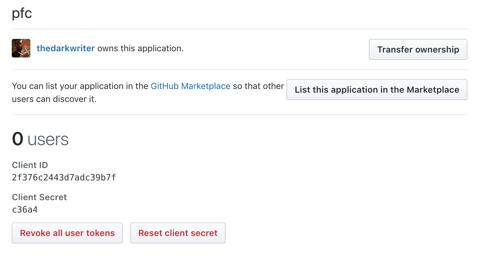
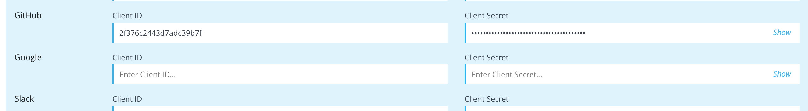
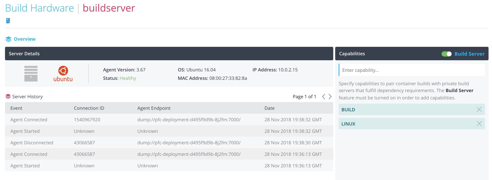

Install/Configure Pipelines for Containers(PFC) - Minikube
================================================
Welcome!  In this portion of the hands-on lab we will  focus on local deployment to Minikube, and we can start building software (in the form of containers, of course)!  
  
In this exercise, we will:
* Get minikube up and running
* Launch our build server
* Deploy PFC (and supporting services) and complete hte initial configuration.

## Start Minikube
* `minikube start --memory=4096`
  * You should see the following output (potentially with different version):
    ```
    Starting local Kubernetes v1.10.0 cluster...
    Starting VM...
    Getting VM IP address...
    Moving files into cluster...
    Downloading localkube binary
    138.70 MB / 138.70 MB [============================================] 100.00% 0s
    0 B / 65 B [----------------------------------------------------------]   0.00%
    65 B / 65 B [======================================================] 100.00% 0sSetting up certs...
    Connecting to cluster...
    Setting up kubeconfig...
    Starting cluster components...
    Kubectl is now configured to use the cluster.
    Loading cached images from config file.
    ```
    > You thought that'd be harder; admit it!  Minikube is a tool specifically designed to provide the ability to do local development for apps running on k8s.  Because of this, minikube comes 'out of the box' with a bunch of sane configurations and is reasonably self-contained.
  * Validate that your single node 'cluster' is up and running with `kubectl cluster-info`
    ```
    Kubernetes master is running at https://192.168.99.101:8443
    ```

## Deploy PFC
* Navigate to `<git clone of pipelines-self-paced>/pipelines-for-containers/assets`
* Using `kubectl` lets deploy PFC.  There is a folder called `pfc` within the `assets` folder.  This folder contains all the resources required to actually run PFC.  Specifically, it has resource specs for the following:
  * Daemonset "traefik-ingress-controller" 
  * Deployment "artifactory" 
  * Deployment "mysql" 
  * Deployment "pfc-deployment" 
  * Persistentvolumeclaim "artifactory-data-new" 
  * Persistentvolumeclaim "mysql-data-new" 
  * Secret "regsecret" 
  * Service "artifactory" 
  * Service "artifactory-nodeport" 
  * Service "mysql" 
  * Service "pfcagent" 
  * Service "pfcagent-nodeport" 
  * Service "pfcbackend" 
  * Service "pfcbackend-nodeport" 
  * Service "pfcfrontend" 
  * Service "pfcfrontend-nodeport" 
  * Service "traefik-ingress-service" 
  * Serviceaccount "traefik-ingress-controller" 
  > Note: Here's some details about what all this stuff is.
  > * [Daemonset](https://kubernetes.io/docs/concepts/workloads/controllers/daemonset/)
  > * [Deployment](https://kubernetes.io/docs/concepts/workloads/controllers/deployment/)
  > * [Persistent Volumes](https://kubernetes.io/docs/concepts/storage/persistent-volumes/)
  > * [Secret](https://kubernetes.io/docs/concepts/configuration/secret/)
  > * [Service](https://kubernetes.io/docs/concepts/services-networking/service/)
  > * [Serviceaccount](https://kubernetes.io/docs/admin/service-accounts-admin/)
* Deploy
    ```
    kubectl apply -f pfc/
    ```
      * Inspect your work; `kubectl get deployments`
    ```
    NAME             DESIRED   CURRENT   UP-TO-DATE   AVAILABLE   AGE
    artifactory      1         1         1            1           14m
    mysql            1         1         1            1           14m
    pfc-deployment   1         1         1            0           14m
    ```
      * So we have three deployments, `mysql` and `artifactory` are both supporting services for PFC.  PFC needs to have a database (mysql in this case) and object storage (in this case artifactory).  Notice that pfc-deployment says 'AVAILABLE' 0?  That seems bad.  Let's dive in further.  To get more details, we need to list the pods that make up this deployment.
    > Note: Depending on your network connection the amount of time pfc-deployment will have a 0 available will vary
    
    * Run `kubectl get pods` to figure out what pods are running
    ```
    NAME                              READY     STATUS            RESTARTS   AGE
    artifactory-6cd9f9b94f-s6wkc      1/1       Running           0          16m
    mysql-b98f95f9b-cx6ng             1/1       Running           0          16m
    pfc-deployment-58885b5b84-wx5hf   0/1       PodInitializing   0          16m
    ```
      > NOTE: In a production k8s cluster you would have TONS of pods and deployments, and you'd need to list your resources using selectors.  You can read more about that [here](https://kubernetes.io/docs/concepts/overview/working-with-objects/labels/)
      
      * So we can see the PFC pod is still initializing, so that's why our deployment has 0 `available`.  Lets get some more details about our PFC pod to figure out what its doing: `kubectl describe pod pfc-deployment-58885b5b84-wx5hf`.  You should now see details, but at the very bottom of the output you'll see an event log.  The last message is latest, and can tell you whats going on.
    ```
    Normal   Pulling                3m (x2 over 6m)  kubelet, minikube  pulling image "pcr-internal.puppet.net/pipelines/pfc:1314"
    ```
      * In this case, its still downloading the PFC container image.  Once this completes; the PFC deployment will become available.
  
* Time to setup some mocked DNS entries.  To do this we are going to use a quick one-liner that will set a few records equal to the minikube instance IP.
    ```
    echo "$(minikube ip) minikube artifactory pfcagent pfcbackend pfcfrontend dev-app qa-app prod-app"| sudo tee -a /etc/hosts
    ```
## What is running? How do I get to it?

Before we can dive into configuring everything, what do we have running exactly.  Each one of the deployments we've built has exposed a different port on the minikube server; this was done via service definitions using `nodePort`.  In order to connect to each service we need to know the port each service is listening on. The following command can grab us that detail (and format the output a bit):
  ```
  kubectl get service|grep nodeport|awk '{split($1,a,"-"); print "Service: "a[1]"\t\t Host/Port:\t"a[1]":"substr($5,6,5)}'
  ```
    
  > What's `nodePort`?  Documentation [here](https://kubernetes.io/docs/concepts/services-networking/service/#type-nodeport)
    
  
  * Once run, you'll get an output like this:
    ```
    Service: artifactory             Host/Port:     artifactory:32004
    Service: pfcagent                Host/Port:     pfcagent:32005
    Service: pfcbackend              Host/Port:     pfcbackend:32007
    Service: pfcfrontend             Host/Port:     pfcfrontend:32006
    ```
  > As we move through the guide, you should have a copy of this output somewhere for reference.  When the guide tells you to connect to artifactory, for example, you'd connect to `artifactory:32004` in your browser.

## Configure Artifactory
* Navigate (in a browser) to [Artifactory](http://artifactory:32004) (Remember this works because we added the /etc/host entry and exposed the nodePort to 32004)

* You'll be prompted with a `Welcome to JFrog Artifactory!` wizard.  
* Click **Next**.
* Set the admin password and click **next**
* Skip the Proxy Server configuration
* In the `Create Repositories` screen, click on **Generic** and click **Create**
  * What are we doing?  We just created a generic repository (i.e. you can store any binary type in this repo and artifactory doesn't try to *read* it)
* Click Finish

## Configure PFC

* To access the PFC configuration wizard; navigate to `http://pfcfrontend:32006` *or click [here](http://pfcfrontend:32006)*
* Click **Get Started**

#### Step 1: Create the Root Account

* The first account we created is the primary admin account.  This account should _never_ be used to create builds or deployments
* Enter the following inputs
  * First Name: _root_
  * Last Name: _account_
  * Email: _noreply@puppet.com_
  * Username: _pfcroot_
  * Password: _puppetlabs_
* Click `Create Root Account`

#### Step 2: Get License

* Click **Select License File**, which will prompt you with a file browser.
* Select the license.json file found in the `assets` folder of this repository.
* Scroll through the EULA and click **Accept**.
* Click **Upload License**

#### Step 3 Configure Endpoints

* Please enter the following information:
  * WebUI: _http://pfcfrontend:32006_
  * Backend Service: _http://pfcbackend:32007_
  * Agent Service: _dump://pfcagent:32005_
* Click **Save Endpoint Settings**.

#### Step 4 Storage

* Using the radio button, select `artifactory`
* Enter the following information:
  * Artifactory Generic Binary Repository Name: _generic-local_
  * Artifactory Endpoint: _http://artifactory:32004/artifactory_
  * Artifactory Access Token
    * Navigate back to Artifactory, in the top-right had side click the down arrow next to `Welcome, admin` and click **Edit Profile**
    * At the top of the page, enter in the password you set in Configure Artifactory and click **Unlock**
    * About midway down the page, you'll see an **Authentication Settings** box and a field labelled **API Key**
    * Click on the Gear to the right of this field, and now copy the API key
    * Back in the PFA UI, paste in this access key so that PFA can make authorized read/writes to the generic-local repository
    * Leave Path Prefix empty
  * Click **Save Storage Settings**

#### Step 5 Integrations

* For this HOL, we will configure OAuth in Github. 
* Navigate to your Github.com profile, `https://github.com/<username>`
* Go to your settings; found in the top right drop down next to the icon you've configured for yourself.
* Click on the **Developer settings** on the left hand side menu (near the bottom).
* Click on **New OAuth App**.
  
  > Note: If your wondering, `what the heck is OAuth?`, you can read more about it here: [Oauth In plain English](https://blog.varonis.com/introduction-to-oauth/)
  
  * Enter in the following inputs
    * Application Name: _pfc_
    * Homepage URL: _http://pfcfrontend:32006_
    * Application Description: _pfc_
    * Authorization callback URL: _http://pfcfrontend:32006_
  

  * Click **Register Application**.

  * In the page that follows; copy the `Client ID` and paste it into the `Client ID` field next to Github in the Integrations page of the PFA wizard.  Do the same for the `Client Secret` field.
  
  * Click **Save Integration Settings**

#### Step 6 Agent

* Once the page says `Agent upload complete`, click **Finish**.

#### Step 7 Single Sign-on

* We aren't going to configure `Single Sign-on`, click **Skip this step**.

You should now be in the PFC console!

#### Create/Configure User Account

>The account that was created previously, `pfcroot`, should **_never_** be used for building or releasing software.  

* We are going to create a new account - named after you - for actually building and deploying software.
* Click on **Logoff**, found in the top-right corner
* In the login page, click on **Create a free account**.  Fill out the form using your own information.  
* Click on **Sign Up**.

## Creating the build server

A build server is required since we aren't using the SaaS version of PFC. Even then, you sometimes need your own build server. There is a server ready for you as a vagrant box. 

  > Reminder, you should still be in the `<git clone of pipelines-self-paced>/pipelines-for-containers/assets` folder
    
  * Vagrant up! (this will likely take a few minutes)
    ```
    vagrant up /buildserver/
    ```
    * So what's going on?  Well, our Vagrant box is Ubuntu 16.04 and it's getting everything it needs installed to build our software.
      * The highlights:
        * Docker
        * Java
        * Maven
* Now that the server is installed, we have to add it to our PFC instance.
  * Click on the **Build Hardware** tab in the top menu bar.
  * Click on **Add Build Server**
  * Select **Add Existing Server**
  * Click on the **curl** tab in step 1 of the wizard.
  * Copy the command provided (you will use it in a few steps)
  * SSH into your vagrant server from a terminal shell:
  ```
  vagrant ssh /buildserver/
  ```
  * Execute the following commands to setup your Pipelines agent:
  ```bash
  # Paste in the curl command and hit enter, make sure you add sudo
  # It should look like this: sudo curl -sSL http://pfcfrontend:32006/download/client | sh
  sudo curl -sSL http://pfcfrontend:32006/download/client | sh

  # Install agent
  sudo /usr/local/bin/distelli agent install

  # Enter the Email and Password you used for your PFC user acount
  # DO NOT ENTER THE ROOT CREDENTIALS < VERY IMPORTANT  
  # ex:
  Distelli Email: jawn@puppet.com
  Distelli Password: M@aster0fPuPPeT$

  # Add the distelli user to the docker group
  sudo usermod -aG docker distelli

  # Restart the Agent
  sudo distelli agent restart
  ```
  * Back in the PFC UI, click **Agent Installed**. You should now see a server listed. It will be named `buildserver` 
  * Click on your server, it will highlight blue
  * Click **Finish**

You will now be in the Build Hardware screen for your buildserver. Click the toggle button the right in the `Capabilities` window, next to `BuildServer`. The toggle will will slide right and be green. Here is an example configured buildserver. 



> Let's get to setting up the application! [here](sample_app.md)


  


