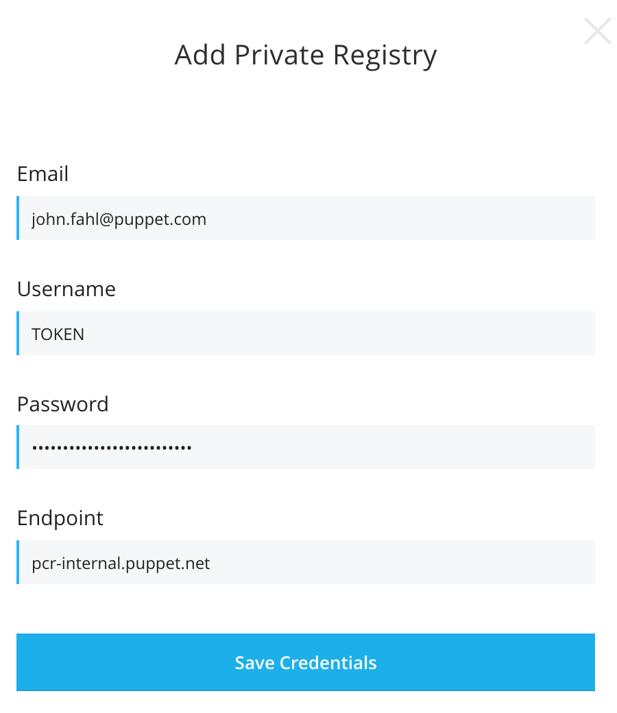
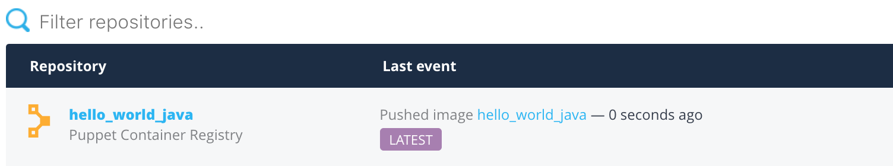
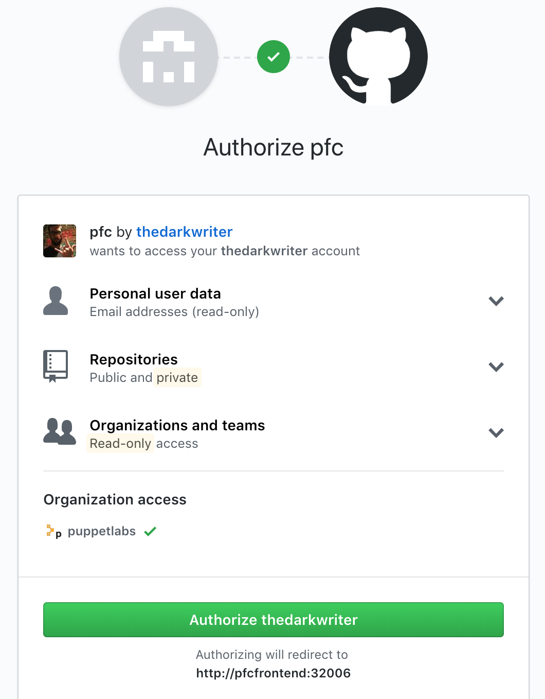
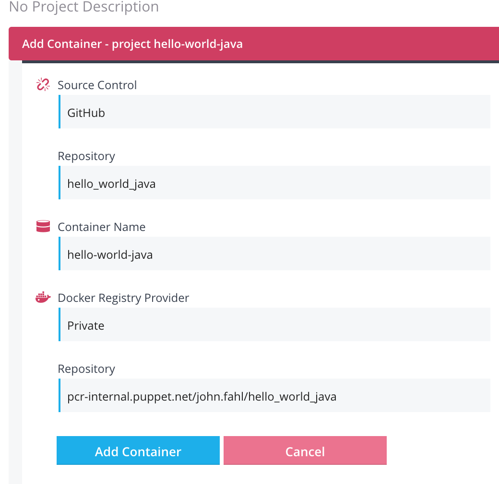

Build and Deploy Sample App
===========================

At this point, you should have a working:
* PFC container
* Artifactory container
* Mysql Container
* Buildserver Vagrant box

Now you will walk through setting up an application to be controlled through Puppet Pipelines. After the application is set up, you will be deploying it to your minikube kubernetes environment.

## Get the code; build it locally

* The application will be, you guessed it, a `hello_world_java` application; found [here](https://github.com/puppetlabs/hello_world_java)
  * Make a fork of this code on Github.
  > IMPORTANT: For this lab to work correctly, you must be working from your fork.
  * Create a local git clone on your laptop and `cd` into that directory
* Once you clone the git repo, you will have a java application in your current working dir.  Its a really basic `hello world` application. The source code is instrumented with a very lightweight testing suite.  When you 'build' the application - these tests will be run first.
  * To build/test this app, you'll use `maven`. Open a shell on your laptop and type:
    ```
    mvn clean test
    ```
    > Note: If you've never used mvn before; you'll likely see a ton of downloading going on - totally normal
    * You should now be looking at some results like this
    ```
    [INFO] ------------------------------------------------------------------------
    [INFO] Reactor Summary:
    [INFO]
    [INFO] hello-world ........................................ SUCCESS [  0.262 s]
    [INFO] polyglot ........................................... SUCCESS [  3.416 s]
    [INFO] java-webapp ........................................ SUCCESS [ 14.789 s]
    ```
    * Now, package up this app so you can start a local copy
    ```
    mvn clean package
    ```
    * You should see the same successful results from `Reactor`, but you'll also notice lines like this in your output:
    ```
    [INFO] --- maven-jar-plugin:3.0.2:jar (default-jar) @ java-webapp ---
    [INFO] Building jar: /Users/<userid>/git/hello_world_java/java_webapp/target/java-webapp-1.4.jar
    ```
    *  Launch the Jar file from your terminal. If you are in the base of the hello_world_java directory, start the jar by executing:
    ```
    java -jar ./java_webapp/target/java-webapp-1.4.jar
    ```
      * You can now connect to `http://localhost:9999` or click [here](http://localhost:9999) to see the running application.
      > In your terminal, Control+C to kill the app after you've verified you can reach the page. It should look like this:
      

      > Side note; if you want to learn more about the java code we're running and using maven, complete the Pipelines for Applications workshop (in the same parent repo)
    * Now that you have a basic application, let's turn the application into a basic docker container.
  
### Time for Docker

In the steps you see <YOURID>, this is your PCR ID (likely your Okta ID). 

We are going to build a container out of this application and push it to PCR.
`
* First, let's build the container. In your terminal, execute:
  ```
  docker build -t pcr-internal.puppet.net/<YOURID>/hello_world_java .
  ```
* Are you wondering what just happened? Let's examine the Dockerfile in the root of the hello_world_java directory.
  * `FROM openjdk:9`: This is the base image to pull and prime with configuration.  By using this image as your 'base' you automatically get Java 9 installed so we don't have to deal with it. (This is a public image located [here](https://hub.docker.com/_/openjdk/))
  * `MAINTAINER puppetlabs`: Who maintains this file.
  * `COPY ...`: Copying the jar file from our working directory into the docker image being build (so we can run it!)
  * `WORKDIR /usr/src`: This tells Docker where the working directory should be for RUN, CMD, or ENTRYPOINT blocks
  * `CMD ...`: This the command that we want to run when the container starts; in our case firing up the `hello world` app
  * `EXPOSE 9999`: Serves as documentation of which ports this container listens on; or in the case of using the `-P` option when running the container docker will automatically map this port to a dynamic port on the host running the container
  * You can read more about available options for Dockerfiles [here](https://docs.docker.com/engine/reference/builder)
* Provided your build succeeded, you can now list your newly created image:
  ```
  $ docker images | grep hello_world_java

  #output
  ...
  pcr-internal.puppet.net/john.fahl/hello_world_java                             latest              13b620c85333        3 minutes ago       870MB
  ```

* Let's start the application, but as a container
  ```
  docker run --rm -it -p 9999:9999 pcr-internal.puppet.net/<YOURID>/hello_world_java:latest
  ```
  * And navigate to `http://localhost:9999`
    * Congratulations!  You've just `dockerized` your application.  Not so mystical, is it?
    * Ctrl-C to kill your running container (since it's in the foreground)

## Adding PCR Integration to PFC

You need to add PCR as a private registry in PFC so that it can pull containers from it when creating projects.

* In the Puppet Container Registry UI, click the settings "cog" .
* On the left menu, click **API Tokens**.
* Click **+ Create Token**. This will generate a new token which you will need for the integration into PFC. Copy that token.
* In the PFC UI, click the **Integrations** tab on the top menu.
* Click **Private Registry**.
* Click **Add Credentials**.
* In the `Add Private Registry` window, enter:
  * Email: YourFirst.LastName@puppet.com
  * Username: **TOKEN**
  * Password: **YourApiToken**  (from PCR)
  * Endpoint: pcr-internal.puppet.net
  
  
  * Click **Save Credentials**

## Pushing your container to PCR

Now that you have your API token, you can also login to PCR from your terminal and push your new container up to the repository.

From your shell, execute the following commands:
```bash
# Login to PCR. This is more secure than providing --password over clear text
docker login -u TOKEN --password-stdin pcr-internal.puppet.net <<< YOURAPIKEY

# Push your container up
docker push pcr-internal.puppet.net/john.fahl/hello_world_java:latest
```
In PCR, you should now see your container!



Next you need to change your docker repo to public.

* In the PCR top menu, click **Repositories**.
* Click the **hello_world_java** repo.
* Click the **Repository Settings** wrench 
* Change radio button from `private` to `public`.

If you don't make this modification, you will have to set up a secret in PFC as detailed [here](https://confluence.puppetlabs.com/display/PIPELINES/Shared+Kubernetes+User+Documentation#SharedKubernetesUserDocumentation-ConfiguringdeploymenttousePCR).

## Building with PFC

You have an application built and now running in a container on your laptop. The next step is to put the application into pipelines, let it build and use PFC to deploy the container to a K8s cluster so that it can be scheduled to run. In this case, the application will be scheduled to run on your minikube instance.

#### Create a Project

In PFC, it is time to create a `Project`.  A project, in PFC, is a logical grouping of multiple containers that make up an application.  Typically, these containers will be deployed together (but don't have to).  It is important to understand that a `project` in PFC can include containers you are building from source as well as existing containers in an external registry.
  
  * Open your [PFC console](http://pfcfrontend:32006).
  * Navigate to the PFC `Projects` tab
  * Click on **New Project** (top-right).
  * Enter `hello-world-java` for your project's name, and click **Create Project**.
  * In the new UI window that opens, click **Add Containers**
    * Under `Building and uploading images?`, click **Connect Source Control**
    * Click in the **Select Source Control...** box
    * In the UI that opens, click **Connect Github**
    * You will see the OAuth confirmation pop up that will look similar to this:
    
    * Click the green **Authorize \<YOURGITHUBID\>** button
      * You may have to enter your Github credentials
    * Click **Select Source Repository**
    * Navigate to your fork of **hello_world_java** and click it, you may have to search for it in the `Search by repository name` window. ex: \<YOURGITHUB\ID\>/hello-world-java
    
    

    * In the **Container Name** field, enter **hello-world-java** (NOTE: hyphens!)
    * Click in the **Docker Registry Provider** field, and select **Use Private Registry**
    * Click in the repository field and enter `pcr-internal.puppet.net/YOURID/hello_world_java`.
    > NOTE: You don't have to select a pre-existing repo, if you type in the name you want it will be dynamically generated during the build process

    

    * Click **Add Container** and then click **Close**.

#### Configure Build Steps

Your first container is added, let's customize several build options.
  
  * On the right side, in your `hello-world-java` project, under containers, click the **Build Instructions** icon 
  * You'll notice some details are already populated, specifically around docker building. This is just template info, let's replace it.
  * Delete everything in the `build` section of the configuration options.
  * Copy and paste in the following code:
    ```
    mvn clean test
    mvn clean package
    docker login -u "$DISTELLI_DOCKER_USERNAME" -p "$DISTELLI_DOCKER_PW" "$DISTELLI_DOCKER_ENDPOINT"
    docker build --quiet=false -t "$DISTELLI_DOCKER_REPO" "$DISTELLI_DOCKER_PATH"
    docker tag "$DISTELLI_DOCKER_REPO" "$DISTELLI_DOCKER_REPO:$DISTELLI_BUILDNUM"
    docker push "$DISTELLI_DOCKER_REPO:$DISTELLI_BUILDNUM"
    ```
    > NOTE: There are duplicated Maven steps here because `package` will run the tests - however for consistency and clarity both steps are included here.
  * Further down in the window, you'll see `Build Hardware` and a couple of radio buttons.  Click the **Build on my own hardware** Radio button.
    > Wait a sec; why not shared hardware?  You won't be setting that up for this tutorial, but you can learn more [here](https://puppet.com/docs/pipelines-for-containers/enterprise/index.html). 
  * In `Build Capabilities` enter **Java**, press Enter.
  * Click **Save**, and after the green pop-over fades away, scroll up and click the **X** on the top red bar

#### Time to Build

* Click the **Build** icon on the right. 
* A new window will open. In the `Build a container` section, click the **hello-world-java** container.
* Select the **master** branch


* Click **build** and then click **View build**
> This process will take approximately 3 minutes.
* You will now see a screen where you can watch the build happen.  The first process you see will have a lot of Maven noise but the second operation (`package`) that executes will be a lot quieter so you can see exactly what's going on.
* Once the build completes, PFC will push built image (because you entered the information in the build configuration options).
* Click the **Projects** button in the very top menu.
* You will see your `hello-world-java` project. Click the green **hello-world-java** name, which will take you into that project.


* You are in the `containers` information tab of `hello-world-java` project.  You'll now see that a successful `Build` occurred and a new `Image` successfully built. If you click the `Image` you'll get details of this image including the image layers.

> NOTE: You can also browse to PCR to verify a new image upload.

## Preparing to Deploy

Now that an image is built, you will:
  * Add Minikube to PFC as a cluster
  * Create a new deployment for `hello-world-java`

#### Adding Minikube as a cluster

* In the top menu, click on **Clusters**.
* Click **Add Cluster**.
* Click **Add Existing Cluster**.
* In the `Select a Provider` window, select `Bare Metal` and click **Continue**.
* In the `Enter Cluster Information` window, enter:
  * Enter your cluster name: `minikube`
  * Enter your cluster region: `local`

* For the next details, open a terminal shell.
  * Get your IP address for minikube
    ```
    # Get Master Endpoint URI
    minikube ip
    ```
  * Enter your Master Endpoint URI: `https://<minikube-ip>:8443`
  * Select Cluster Authentication Method: select `Connect using cluster SSL Certificates`
    ```
    # Get client certificate
    cat ~/.minikube/client.crt
    ```
  * Enter your client certificate: copy/paste `~/.minikube/client.crt`
    ```
    # Get client key
    cat ~/.minikube/client.key
    ```
  * Enter your client key: copy/paste `cat ~/.minikube/client.key`
    ```
    # Get cluster certificate 
    cat ~/.minikube/ca.pem
    ```
  * Enter your cluster certificate: copy/paste `cat ~/.minikube/ca.pem`
* Click **Add Cluster** and then click **View Cluster**.
  * In this screen you can see information about your minikube cluster (i.e the version, nodes, pods,)
  * This tutorial doesn't cover all operations that are possible, but a good place to get more detail is [here](https://puppet.com/docs/pipelines-for-containers/enterprise/cluster-view.html)

#### <a src='timetodeploy'>Time to Deploy</a>

The container is built, the cluster is also added to PFC. You are ready to deploy the container to kubernetes.
  
* In the top menu, click **Projects**.
* Click your project **hello-world-java**.
* In the right menu, click the **Deploy** rocket button 
  * Click in the **cluster** field then select the `minikube` cluster.
  * Click in the **namespace** field then select `default`.
    
  > If you want to understand namespaces better, here is further [reading](https://kubernetes.io/docs/concepts/overview/working-with-objects/namespaces/).
    
  * Click in the **Deployment Name** field then select `CREATE NEW DEPLOYMENT`
    * Enter the name: `dev-hello-world-java`
  * Click in the **Deployment Description** field then enter: `Dev Hello World Java`
  
  Further down the the screen, you will see that `Containers` is already selected. Now you will add the container to the deployment. 
    * Click in the **Select Container** field, and then select `hello-world-java`.
    * Click in the **Select Image Tag** field, choose the container you've built. There should be only one unless you've built multiple. It will also be tagged with the Pipelines build number, if so, picked the highest number. It will likely be in the format of:`pcr-internal.puppet.net/<YOURID>/hello_world_java:487876`.
    
    * Click **Add Container**.
    
    > There is a lot you can configure about a deployment.  For this deployment we don't actually need to adjust anything, but take the opportunity to click around in this interface.  You can adjust per container properties (port mappings, volumes, env vars), or deployment wide settings like deployment strategies revision history or volumes.
  
  * Click **Deploy** and it will launch your new deployment and supporting pod(s).
  * Now that `Deployment has initiated`, click **Click here**.  
  * In this window you will get an overview of the deployment status. This window is not like the build window where you get a stream of the running process. If the deployment is a success or failure, it will update the message block. You should see `Success` in the upper left hand side. 
  
  * Once completed, in the very top menu, click  **Clusters**.
  * Click **minikube**.
  * From the cluster overview page, you'll see `Pod Sets` section.  Look for `Pod Name: dev-hello-world-java...` in the list.
  
    > NOTE: Depending on how long the download of the image takes you might see a loading spinner next to your pod.  This is because it is still initializing (in this case waiting to finish downloading the image from PCR). You'll need to wait for that to finish before you move on.  If you want more detail you can use `kubectl describe pod <pod>` to view the events.
  
  * On the right hand side, click on the `View Pod Logs` icon .
  * In the new screen, click the **Log** slider
    * Just like when we ran this app locally on our laptop, we can now see the STDOUT from this container and validate its up/running.
      
  #### <a src='createservice'>Creating a Service</a>

  To access your dev deployment, you must create a `service` in k8s.  There's a few different types of services; you can read about them [here](https://kubernetes.io/docs/concepts/services-networking/service/).  Thus far in the guide you have been accessing PFC (and the supporting services) through `nodePort` services, which allows you to access your deployment externally from the cluster via a high-numbered port (between 30k and 32767 by default). You will now create a `nodePort` service for `hello-world-java`.
    
  * In the very top menu, click **Projects**.
  * Click **hello-world-java**.
  * Click the **Services** tab.
  * Select your cluster - `minikube` - from the list and click **Create a new service**.
  * Unlike the Deployment workflow that is 100% GUI driven, here you define a service in its native YAML format.  There's an option to `Load default service spec` (don't click it right now) that will give you 99% of what you need and you just update the ports.
  * However, for today, copy/paste this into the window:
    ```
    apiVersion: v1
    kind: Service
    metadata:
      name: dev-hello-world-java
      labels:
        app: hello-world-java
        stage: dev
    spec:
      ports:
        - port: 9999
          nodePort: 32100
          name: nodeport
      selector:
        deployment: dev-hello-world-java
      type: NodePort
    ```
    * Here is what this YAML config is doing:
      * The first two lines are defining the version of the api this definition uses and the type of definition it is
      * Lines 3-7 are defining what the service should be called, and the labels associated with it so this can be found more easily via selectors
      * Lines 9-12 are the primary config.  
        * Line 10 defines the container port (`9999`).
        * Line 11 defines the `nodePort`, that is the port on the actually k8s node(s) that should be exposed for this service (`32100`).
        * Line 12 defines a friendly name to the port; again this is to make it easier to find/use in other definitions ... such as [Ingress](https://kubernetes.io/docs/concepts/services-networking/ingress/).
      * Lines 13-14 defines which deployment this service exposes.  Using the selector, you are telling your service to expose a deployment named `dev-hello-world-java`.
      * Line 15 defines the type of service we are creating.
  * Once pasted into the box; click **Create Service**.  You should see a `Successfully created...` pop-over.
  * Click **Go to Cluster Details**.
    * On the right side you'll see 3 tabs: `Deployments, Services, and Jobs`.  Click **Services**.  From the list you can now see your new service and are able to inspect it.
  * Now if you connect to your cluster node on port `32100` you will see your running app!
    * In a browser, go to `http://dev-app:32100`
    
In the next section you will be defining a [delivery pipline](delivery_pipeline.md).