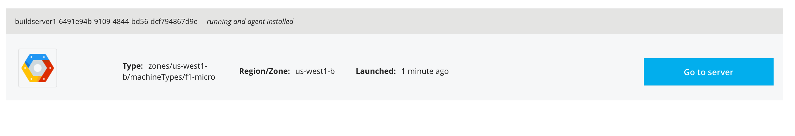
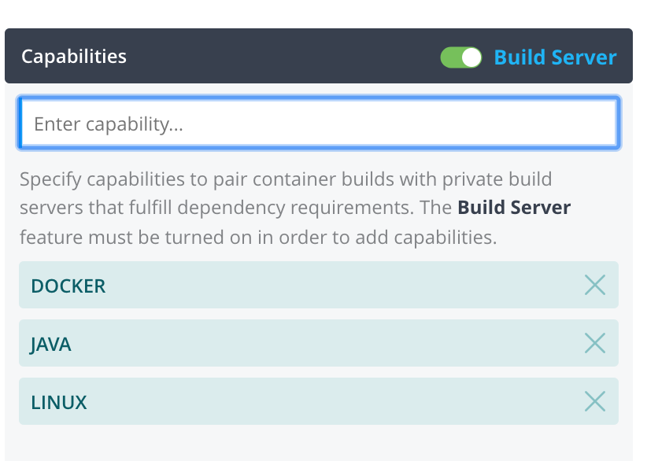
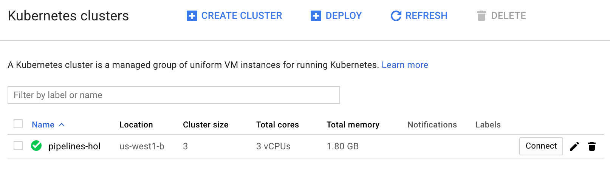

Google Kubernetes Engine Setup
==============================

You will be creating a GKE cluster and a Compute Engine (buildserver) to support your Java application. All of these items can be configured directly on GCP but you will be taking advantage of using Puppet Pipelines to help you create these resources through it's UI.

### Create a GKE Cluster

* In the top menu, click **Clusters**.
* Click **Add Cluster**.
* Click **New Google Container Engine Cluster**
    > Click **Continue** after each section
    * Select Project: Click your **Project** from your account.
    * Name your Cluster: **pipelines-hol**
    * Select Zone: **us-west1-b**
    * Select Machine Type: **g1-small**
    * Enter the number of nodes in your cluster: **3**
    * The IP addresses...: **10.0.0.0/14**
    * Enter Disk Size in GB...: **10**
    * Select Kubernetes Version: **1.11.3-gke.18**
    * Configure Tags: *defaults*
    * Access Scopes: *defaults*
    * Please enter the creds...: enter a `username` and a 16 character `password`.
    * Launch Cluster!: **Launch**

This will take a few minutes to provision. You can click on **Monitor Launch** if you want to observe the operation in GCP.

While the cluster is provisioning, you can move to the next step of provisioning the build server.


### Creating a buildserver

Buildservers are required to perform application build operations in Puppet Pipelines. In this case, it will be building your containers and then pushing them into Dockerhub.

You could create a server in GCP and then manually setup the Pipelines agent to connect to Puppet Pipelines, but if you use Pipelines to launch the server, it will connect the server for you!

* In the top menu, click **Build Hardware**.
* Click **Add Build Server**.
* Click **New Google Compute Instance**.
    > Click **Continue** after each section
    * Select Project: Click your **Project** from your account.
    * Name your Instances: **buildserver1**
    * Select Zone: **us-west1-b**
    * Select Machine Type: **f1-micro**
    * Select Image Type: **ubuntu-1604-xenial-v20181204**
    * Configure Boot Disk:
        * Select Disk Type: **Standard Persistent Disk**
        * Enter Disk Size: **10**
    * Configure Firewall: Check **Allow HTTPS Traffic**
    * Configure SSH Keys: *This step is optional*
        If you don't want to access your buildserver through your laptop, just enter **Nokey** in the `SSH Keyname` field. Enter **NoKey** into the contents window.

        If you want to be able to SSH into your buildserver, generate a keypair in a shell windows:
        ```
        # Generate the keypair
        ssh-keygen -t rsa
        
        # When asked, save the keypair with a name such as pfc_keypair.
        
        # Don't enter a passphrase
        
        # You will see two keys, the key with the .pub extention is the public key. Copy it's contents into the `Configure SSH Key` window.

        cat pfc_keypair.pub 

        # Sample contents:
        ssh-rsa AAAAB3NzaC1yc2EAAAADAQABAAABAQDJCasaJ6pnWNDb+IcHSacJyoWcUACj+abcDfZM3cWJDRYZ5PeG1AL6D/+YdLSI40vBLy4yR8QqWwGmEjMk6z/RzLsc8IvcgtCyplMBmxlyWWsoLqxlwRBtRboIfV2HBqCk0jycAovQFYAEDm340sW23cEr7wbC3zN3cy+eYdJy6vO/pfJsLs0bTyakUP5nJRSMt67Hby4Ol0NdnGIe3lasVShgspqGcpmqBM7I05BhU0N6n1YwqoIIg6GcV8hFKcGxwgXeOeRnMvwr8/mQrSlFhK2Ka5rqFzINIZzEa6kK+7jipaxcldmk/venJZfnYS7rpxOKCbEJcT1T6POUQaN9 
        ```
    * Configure Tag and Startup Script: 
        * Specify one tag per line below: *Leave blank*
        * Specify one startup script command per line below: Copy the contents of this script into the script field:
        ```
        logfile=/var/log/bootstrap.local.log
        exec >> $logfile 2>&1
        apt-get update
        apt-get install -y software-properties-common python-software-properties curl apt-transport-https
        curl -fsSL https://download.docker.com/linux/ubuntu/gpg | sudo apt-key add -
        add-apt-repository ppa:openjdk-r/ppa
        add-apt-repository "deb [arch=amd64] https://download.docker.com/linux/ubuntu $(lsb_release -cs) stable"
        apt-get update
        apt-get install -y openjdk-8-jdk ca-certificates-java build-essential checkinstall git libssl-dev \
          openssh-client openssh-server ca-certificates docker-ce
        /var/lib/dpkg/info/ca-certificates-java.postinst configure
        update-java-alternatives -s java-1.8.0-openjdk-amd64
        apt-get install maven -y
        locale-gen en_US.UTF-8
        export LANG=en_US.utf8
        echo 'LANG=en_US.utf8' >> /etc/default/locale
        echo 'export LANG=en_US.utf8' >> /etc/profile
        usermod -aG docker distelli
        distelli agent restart
        echo ''
        echo 'Setup complete!'
        ```
    * Add Environments: **Click Continue**
    * Select Service Account: **Compute Engine Default Service Account**
        * When the options windows pops up, just click **Continue**
    * Select Number of Instances and Launch!: **Launch**

* Wait on this screen until the buildserver finishes. It will take 1-3 minutes. Once it's complete, click **Go to server**.



Now you will be preparing the buildserver to accept your builds. You can configure buildservers to properly build your applications and containers. You flag buildservers with `Capabilities` so that if you were to build a `Java` application, it would select a buildserver with `Java` as one of its capabilities (meaning you may have configured the buildserver with Openjdk, Maven, Gradle, etc.)

* In the right menu, toggle the **Build Server** botton to the right (it will flip green).

* Your buildserver is already flagged with `Linux` as a capability since it's a Linux server. Click in the **Enter Capability** window and add these Capabilities (hitting Enter after each):
    * java
    * docker




### Verify your K8s cluster is ready

Let's ensure you can connect to the GKE environment in GCP and get familiar with using the `Cloud Shell`.

* Navigate to your [GCP UI](https://console.cloud.google.com).
* In the left menu, click **Kubernetes Engine**.



* You will see the `pipelines-hol` cluster you built via Puppet Pipelines. Click the **Connect** button on the right.
* Click **Run in Cloud Shell**. 
    * Once the `Cloud Shell` opens at the bottom, it will drop in a command to connect
        ```
        gcloud container clusters get-credentials pipelines-hol --zone us-west1-b --project <Your Google Project>
        ```
    * Press **Enter**
    * You should see this response:
        ```
        Fetching cluster endpoint and auth data.
        kubeconfig entry generated for pipelines-hol.
        ```
    * Try running the following commands and look at the output:
        ```
        kubectl cluster-info
        kubectl get deployments # Should be 0
        kubectl get nodes       # Should be 3
        kubectl get pods        # Should be 0
        ```
* Leave this shell running because you'll refer back to it later in the lab. It will be referred to as `Cloud Shell`.

Now you are ready to move on to [building and deploying your application](builddeploy_gke.md).